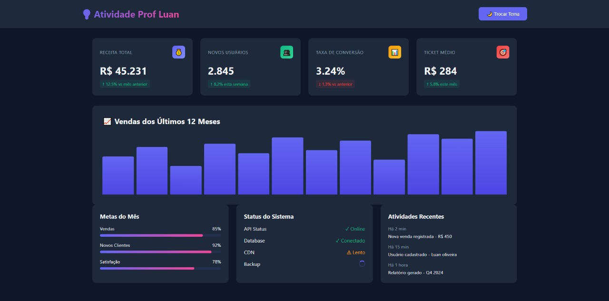

# Atividade-1-ProfLuan-Dashboard


## Descrição
Bem-vindo ao **Atividade-1-ProfLuan-Dashboard**! Este é um projeto incrível de um dashboard interativo desenvolvido para demonstrar habilidades em desenvolvimento web front-end. Utilizando HTML, CSS e JavaScript puro, criamos uma interface moderna e responsiva que permite visualizar e interagir com dados de forma intuitiva e elegante.

O dashboard inclui elementos visuais dinâmicos, como gráficos, tabelas e controles interativos, proporcionando uma experiência de usuário fluida e envolvente. Ideal para aprender conceitos fundamentais de web development ou como base para projetos mais avançados!

## Tecnologias Utilizadas
- **HTML5**: Estrutura semântica da página
- **CSS3**: Estilização responsiva e moderna
- **JavaScript**: Interatividade e manipulação dinâmica do DOM

## Como Usar
1. Clone este repositório:
   ```
   git clone https://github.com/VictorNascimento14/Atividade-1-ProfLuan-Dashboard.git
   ```
2. Abra o arquivo `index.html` em seu navegador web preferido.
3. Explore o dashboard e interaja com os elementos!

## Demonstração



## Contribuição
Sinta-se à vontade para contribuir com melhorias, correções de bugs ou novas funcionalidades. Abra uma issue ou envie um pull request!

## Licença
Este projeto está sob a licença MIT. Veja o arquivo `LICENSE` para mais detalhes.
